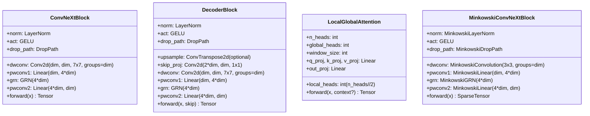
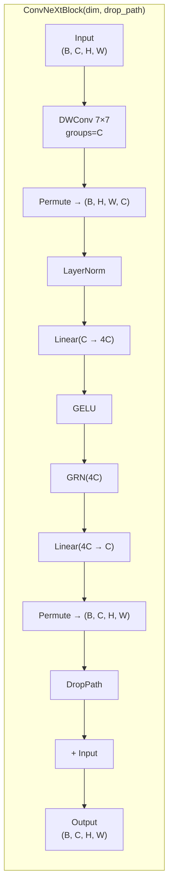
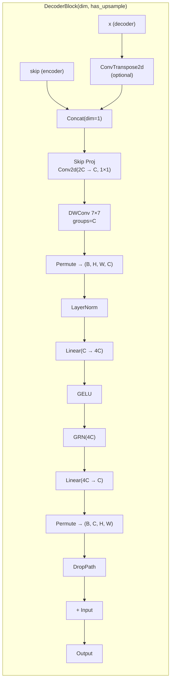
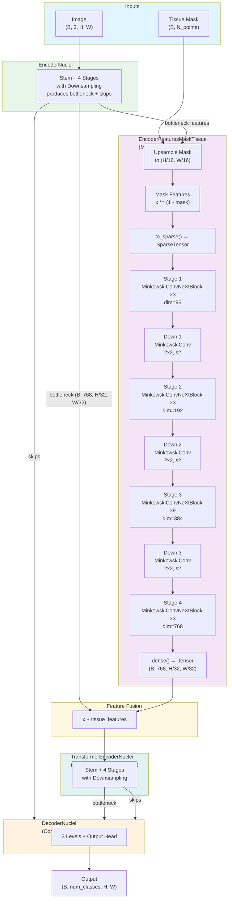
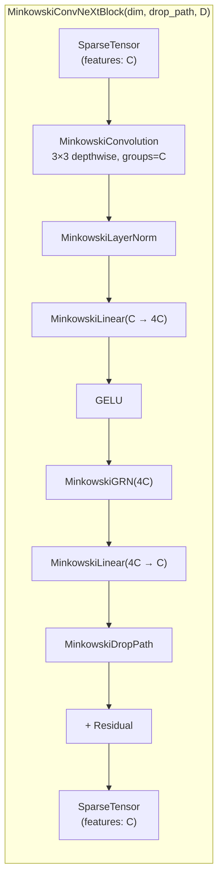
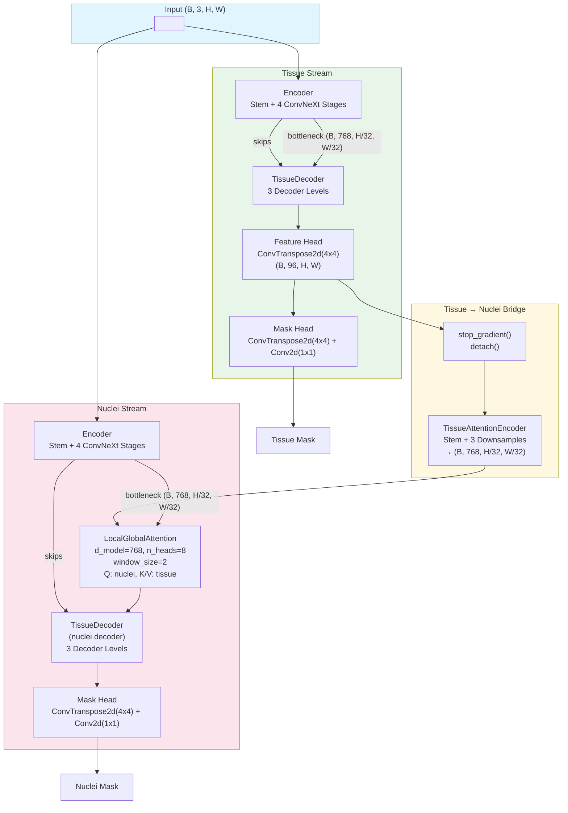
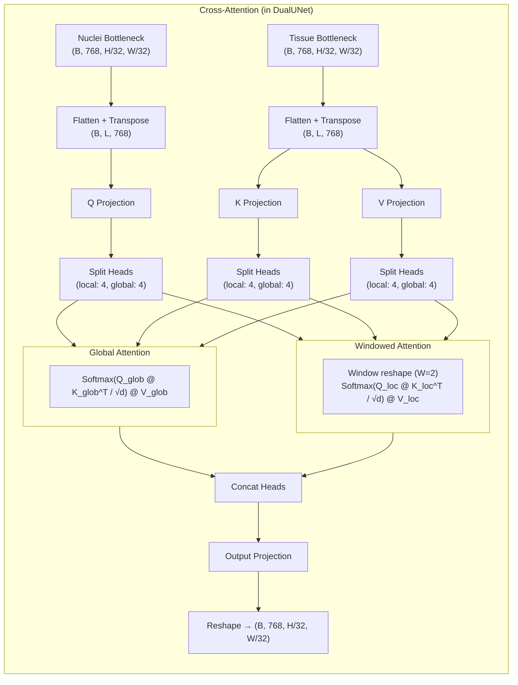
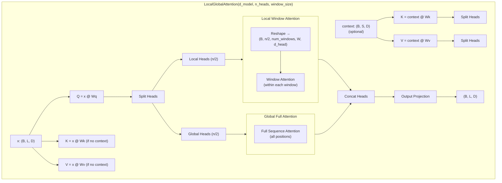
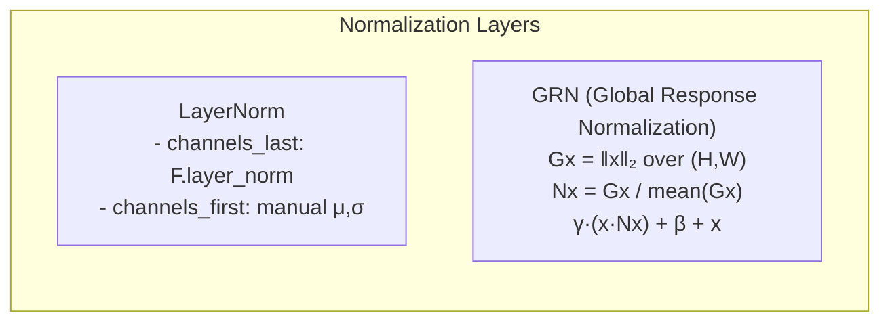

# Prometheus Architecture

## Overview

Prometheus is a medical image segmentation framework built on a **ConvNeXt-v2 U-Net** backbone. It provides three model variants:

| Model | Description |
|-------|-------------|
| **UNetTissue** | Standard ConvNeXt U-Net for tissue segmentation |
| **UNetNuclei** | Extended U-Net with MinkowskiEngine sparse tissue-mask encoder + transformer bottleneck |
| **DualUNet** | Dual-stream architecture: tissue stream + nuclei stream with cross-attention fusion |

## Core Configuration

```python
ModelConfig:
  in_chans: 3
  num_classes: 1
  encoder_dims: [96, 192, 384, 768]
  encoder_depths: [3, 3, 9, 3]
  drop_path_rate: 0.1
  D: 2  # spatial dimension (2D or 3D for MinkowskiEngine)
```

## Model Hierarchy



## UNetTissue

**File:** `src/prometheus/models/unet_tissue.py`

A straightforward ConvNeXt U-Net with symmetric encoder-decoder and skip connections.


### ConvNeXtBlock Detail



### DecoderBlock Detail



## UNetNuclei

**File:** `src/prometheus/models/unet_nuclei.py`

Extends the base U-Net with a **MinkowskiEngine sparse tissue-mask encoder** and a concatenated second encoder at the bottleneck. Requires the tissue mask as a second input.



### MinkowskiConvNeXtBlock Detail



## DualUNet

**File:** `src/prometheus/models/unet_dual.py`

A dual-stream architecture with **stop-gradient** isolation between tissue and nuclei streams. The tissue stream's feature map is encoded and fused into the nuclei bottleneck via **LocalGlobalAttention** cross-attention. Does not require MinkowskiEngine.



### Cross-Attention Fusion Detail



## LocalGlobalAttention

**File:** `src/prometheus/blocks/attention.py`

Splits attention heads 50/50 into **local** (windowed, Swin-style) and **global** (full sequence). Supports both self-attention and cross-attention modes.



## Normalization Utilities

**File:** `src/prometheus/utils/norm.py`



## Package Structure

```
src/prometheus/
├── config.py                     ModelConfig dataclass
├── blocks/
│   ├── convnext_block.py         ConvNeXtBlock
│   ├── decoder_block.py          DecoderBlock
│   ├── attention.py              LocalGlobalAttention, CrossAttention
│   └── minkowski_block.py        MinkowskiConvNeXtBlock
├── models/
│   ├── _base_unet.py             build_encoder, forward_encoder,
│   │                             build_decoder, forward_decoder
│   ├── unet_tissue.py            UNetTissue
│   ├── unet_nuclei.py            UNetNuclei
│   └── unet_dual.py              DualUNet
└── utils/
    ├── norm.py                   LayerNorm, GRN
    └── minkowski_utils.py        MinkowskiGRN, MinkowskiDropPath,
                                  MinkowskiLayerNorm, require_minkowski_engine
```

## Design Highlights

1. **ConvNeXt-v2 backbone:** Depthwise 7×7 conv + LayerNorm + GELU + GRN + DropPath — no BatchNorm, no ReLU.
2. **Local-Global Attention:** 50/50 head split between windowed (Swin-style) and full-sequence attention.
3. **MinkowskiEngine sparse conv:** `UNetNuclei` uses sparse 3×3 ConvNeXt blocks on masked tissue features for efficiency.
4. **Stop-gradient isolation:** `DualUNet` uses `.detach()` to prevent nuclei gradients from flowing into the tissue decoder, allowing independent training of each stream.
5. **Stochastic depth scheduling:** Drop path rates linearly increase from 0 to `drop_path_rate` across all blocks following ConvNeXt convention.
