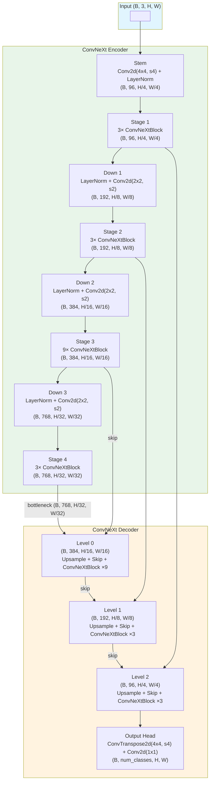
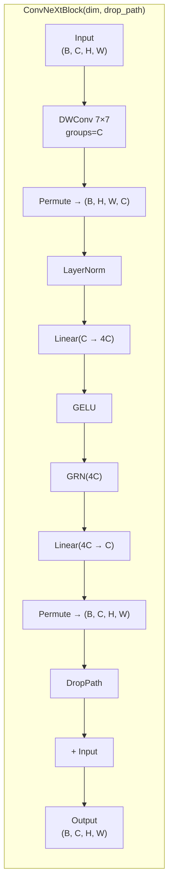
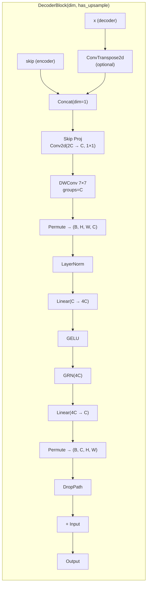
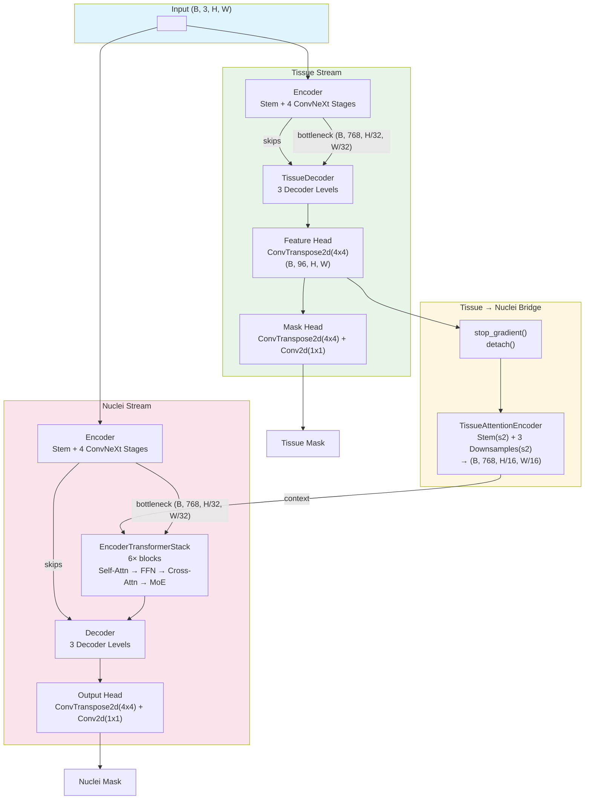
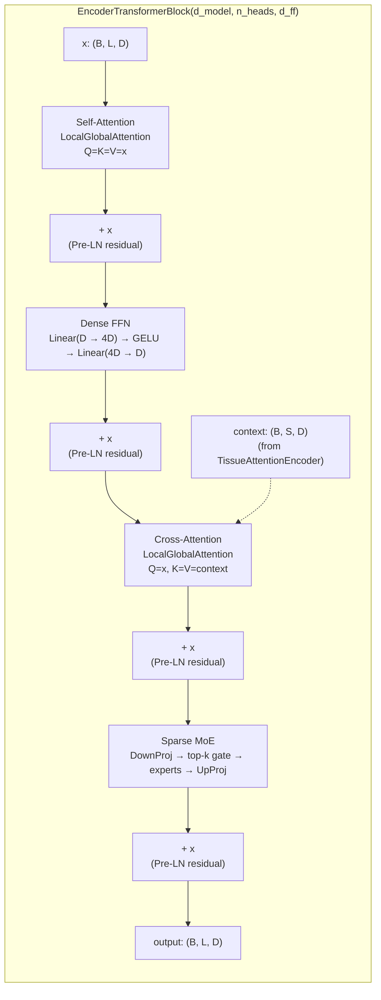
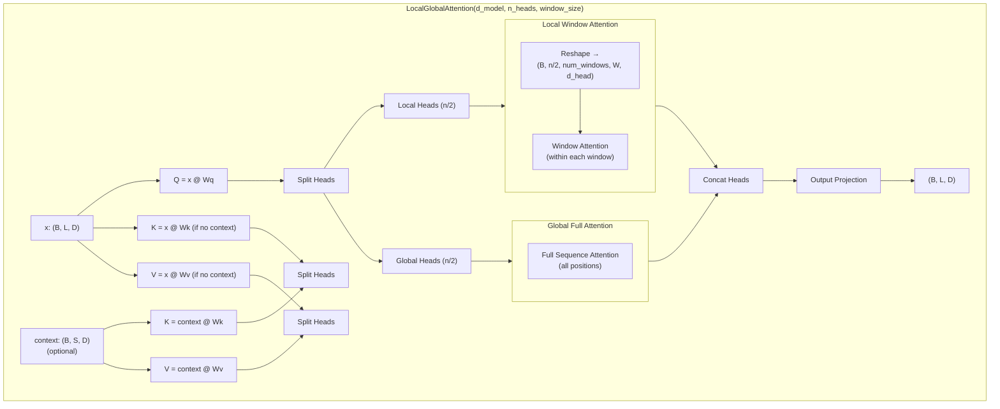
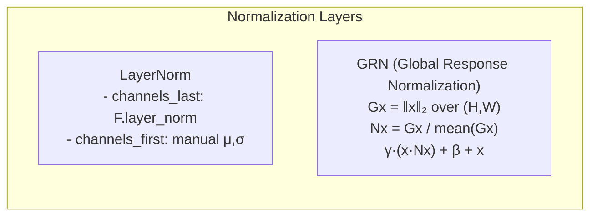

# Prometheus Architecture

## Overview

Prometheus is a medical image segmentation framework built on a **ConvNeXt-v2 U-Net** backbone. It provides two model variants:

| Model | Description |
|-------|-------------|
| **UNetTissue** | Standard ConvNeXt U-Net for tissue segmentation |
| **DualUNet** | Dual-stream architecture: tissue stream + nuclei stream with cross-attention fusion |

## Core Configuration

```python
ModelConfig:
  in_chans: 3
  num_classes: 1              # used only by UNetTissue output head
  num_tissue_classes: 6       # used by DualUNet tissue head
  num_nuclei_classes: 11      # used by DualUNet nuclei head
  encoder_dims: [96, 192, 384, 768]
  encoder_depths: [3, 3, 9, 3]
  drop_path_rate: 0.1
  D: 2
  window_size: 8              # local window size for attention
  num_transformer_blocks: 6
  num_experts: 16
  moe_top_k: 2
```

## Model Hierarchy

```mermaid
classDiagram
    class ConvNeXtBlock {
        +dwconv: Conv2d(dim, dim, 7x7, groups=dim)
        +norm: LayerNorm
        +pwconv1: Linear(dim, 4*dim)
        +act: GELU
        +grn: GRN(4*dim)
        +pwconv2: Linear(4*dim, dim)
        +drop_path: DropPath
        +forward(x) Tensor
    }

    class DecoderBlock {
        +upsample: ConvTranspose2d (optional)
        +skip_proj: Conv2d(2*dim, dim, 1x1)
        +dwconv: Conv2d(dim, dim, 7x7, groups=dim)
        +norm: LayerNorm
        +pwconv1: Linear(dim, 4*dim)
        +act: GELU
        +grn: GRN(4*dim)
        +pwconv2: Linear(4*dim, dim)
        +drop_path: DropPath
        +forward(x, skip) Tensor
    }

    class LocalGlobalAttention {
        +n_heads: int
        +local_heads: int (n_heads//2)
        +global_heads: int
        +window_size: int
        +d_model: int
        +d_head: int
        +q_proj, k_proj, v_proj: Linear
        +out_proj: Linear
        +forward(x, context?) Tensor
    }

    class EncoderTransformerBlock {
        +self_attn: LocalGlobalAttention
        +ffn: Sequential(Linear, GELU, Linear)
        +cross_attn: LocalGlobalAttention
        +moe: SparseMoE
        +norm1..8: LayerNorm
        +dropout: Dropout
        +forward(x, context?) Tuple[Tensor, Tensor]
    }

    class EncoderTransformerStack {
        +blocks: ModuleList[EncoderTransformerBlock]
        +forward(x, context?) Tuple[Tensor, Tensor]
    }

    class Expert {
        +fc1: Linear(d_expert, d_ff)
        +act: SiLU
        +fc2: Linear(d_ff, d_expert)
        +forward(x) Tensor
    }

    class SparseMoE {
        +down_proj: Linear(d_model, d_expert)
        +up_proj: Linear(d_expert, d_model)
        +gate: Linear(d_model, num_experts)
        +experts: ModuleList[Expert]
        +forward(x) Tuple[Tensor, Tensor]
    }

```



## UNetTissue

**File:** `src/prometheus/models/unet_tissue.py`

A straightforward ConvNeXt U-Net with symmetric encoder-decoder and skip connections.



### ConvNeXtBlock Detail



### DecoderBlock Detail



## DualUNet

**File:** `src/prometheus/models/unet_dual.py`

A dual-stream architecture with **stop-gradient** isolation between tissue and nuclei streams. The tissue stream's feature map is encoded via `TissueAttentionEncoder` (2× stem + 3× 2× downsamples = 16× reduction) and fused into the nuclei bottleneck through an **EncoderTransformerStack** (6× blocks, each with Self-Attn → FFN → Cross-Attn → Sparse MoE with 16 experts, top-2).



### EncoderTransformerBlock Detail

Each of the 6 transformer blocks in the stack follows this structure:



## LocalGlobalAttention

**File:** `src/prometheus/blocks/attention.py`

Splits attention heads 50/50 into **local** (windowed, Swin-style) and **global** (full sequence). Supports both self-attention and cross-attention modes.



## Normalization Utilities

**File:** `src/prometheus/utils/norm.py`



## Package Structure

```
src/prometheus/
├── __init__.py              # Package init, exports UNetTissue, DualUNet, all losses
├── config.py                # ModelConfig, TrainingConfig dataclasses
├── blocks/
│   ├── __init__.py
│   ├── attention.py         # LocalGlobalAttention
│   ├── convnext_block.py    # ConvNeXtBlock
│   ├── decoder_block.py     # DecoderBlock
│   ├── moe.py               # Expert, SparseMoE
│   └── transformer_block.py # EncoderTransformerBlock, EncoderTransformerStack
├── models/
│   ├── __init__.py
│   ├── _base_unet.py        # build_encoder, forward_encoder, build_decoder, forward_decoder
│   ├── unet_tissue.py       # UNetTissue
│   └── unet_dual.py         # DualUNet
├── losses/
│   ├── __init__.py
│   └── segmentation.py      # BCEWithLogitsLoss, DiceLoss, FocalLoss, CombinedLoss, MultiClassDiceLoss, MulticlassCombinedLoss, TverskyLoss
└── utils/
    ├── __init__.py
    └── norm.py              # LayerNorm, GRN
```

## Design Highlights

1. **ConvNeXt-v2 backbone:** Depthwise 7×7 conv + LayerNorm + GELU + GRN + DropPath — no BatchNorm, no ReLU.
2. **Local-Global Attention:** 50/50 head split between windowed (Swin-style) and full-sequence attention.
3. **Stop-gradient isolation:** `DualUNet` uses `.detach()` to prevent nuclei gradients from flowing into the tissue decoder, allowing independent training of each stream.
4. **Stochastic depth scheduling:** Drop path rates linearly increase from 0 to `drop_path_rate` across all blocks following ConvNeXt convention.