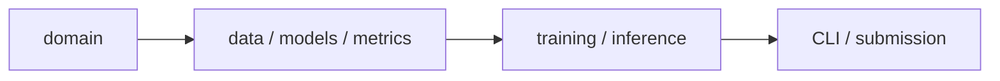
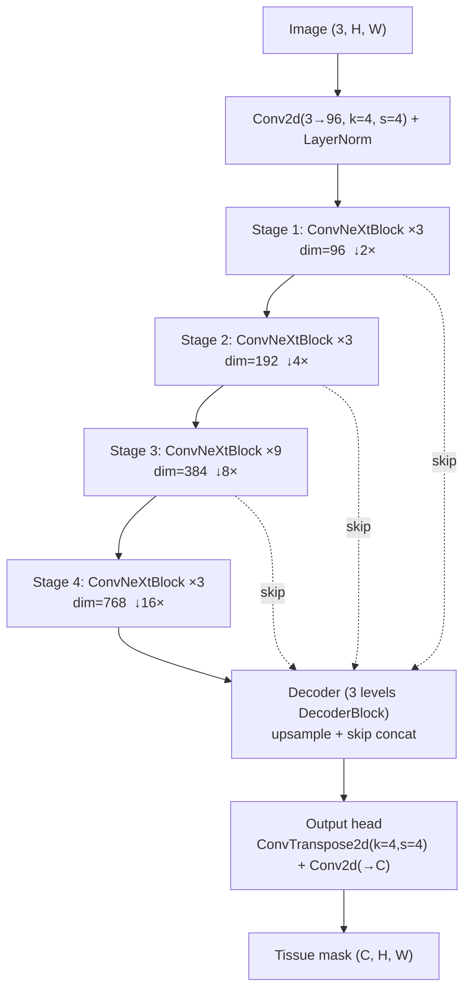
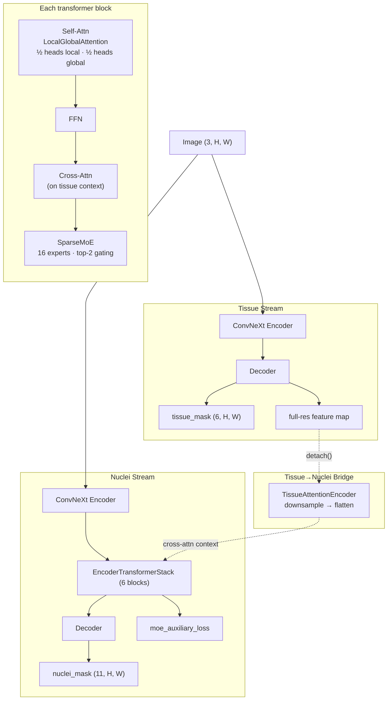
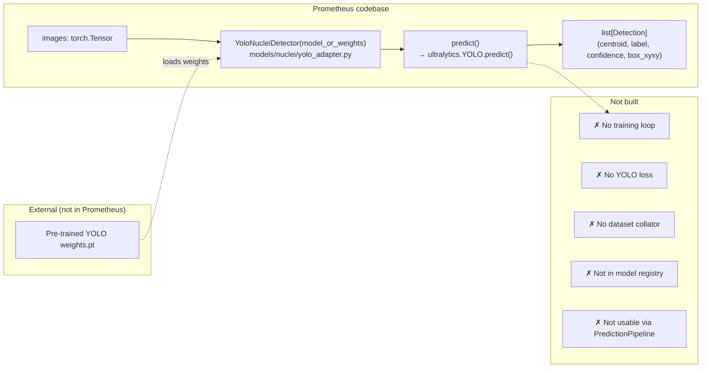
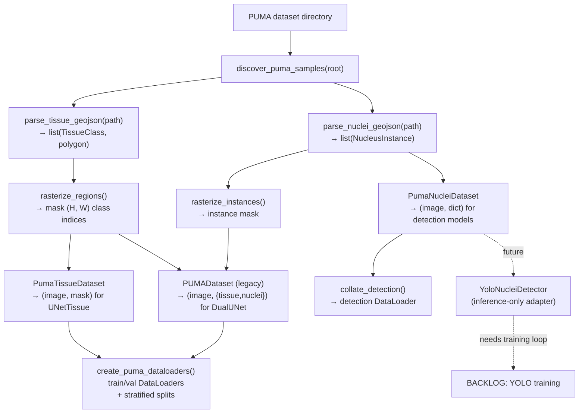
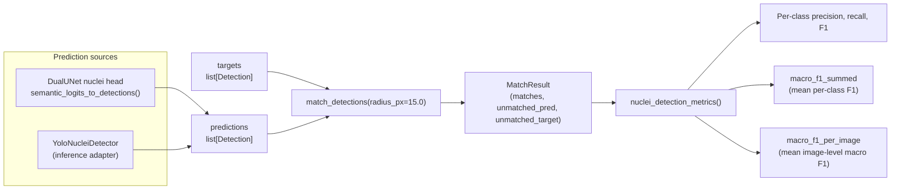

# Prometheus architecture

Prometheus uses dependency-oriented layers rather than organizing code around
individual experiments:

## Package layers

| Layer | Responsibility |
|---|---|
| `prometheus.domain` | Canonical labels (`TissueClass`, `NucleusClass`), geometry, and typed predictions (`PumaSample`, `Detection`, `NucleusInstance`) |
| `prometheus.data.puma` | PUMA filesystem discovery, strict GeoJSON parsing, rasterization, augmentations, `torch.utils.data.Dataset` classes |
| `prometheus.models` | Complete model architectures and optional framework adapters |
| `prometheus.metrics` | Task metrics: segmentation Dice/IoU + PUMA centroid-matching detection F1 |
| `prometheus.training` | Legacy `Trainer` + versioned `CheckpointService` |
| `prometheus.inference` | `PredictionPipeline` + `semantic_logits_to_detections` post-processing |
| `prometheus.io` | PUMA JSON/TIFF serializers |
| `prometheus.cli` | Audit, train, evaluate, and predict CLI commands |
| `prometheus.config` | `ModelConfig`, `TrainingConfig` dataclasses + TOML config loader |
| `prometheus.blocks` | Reusable neural layers (ConvNeXt, Transformer, MoE) |

---

## Working models

### UNetTissue / ConvNeXtUNet — `models/tissue/convnext_unet.py`

The primary tissue-segmentation model. A **pure ConvNeXt-V2 U-Net**:

Each `ConvNeXtBlock`: DWConv 7×7 → LayerNorm → Linear(×4) → GELU → GRN → Linear(÷4) → residual + DropPath

Registered as `"tissue_convnext_unet"`, exported as `UNetTissue`.

### DualUNet — `models/multitask/dual_unet_legacy.py`

Legacy dual-stream model for simultaneous tissue + nuclei segmentation. **Not the target nuclei architecture** (kept for checkpoint compatibility):

**Forward output:** 3-tuple `(tissue_logits, nuclei_logits, moe_loss)`.

Registered as `"legacy_dual_unet"`, exported as `DualUNet`.

---

## YOLO status

**YOLO is NOT implemented within Prometheus.** `YoloNucleiDetector` (`models/nuclei/yolo_adapter.py`) is a thin **inference-only adapter** that wraps a pre-trained `ultralytics.YOLO` model:

- Constructor loads external weights via `ultralytics.YOLO(weights)`.
- `predict(images)` runs inference and converts outputs to `Detection` dataclasses (centroid, label, confidence, box).
- **Not registered** in the model registry.
- **Not usable** through `PredictionPipeline` (which expects DualUNet's 3-tuple output).
- **No YOLO training loop**, no YOLO loss, no YOLO dataset collator in Prometheus.
- Requires optional `[yolo]` extra (`uv sync --extra yolo`) for the `ultralytics` dependency.

YOLO training is explicitly documented as **backlog** (see `README.md` and `REFACTORING_GUIDE.md`).

---

## Building blocks (`prometheus.blocks`)

| Block | File | Purpose |
|---|---|---|
| `ConvNeXtBlock` | `blocks/convnext_block.py` | ConvNeXt V2: DWConv 7×7 → LN → Linear(×4) → GELU → GRN → Linear(÷4) → DropPath |
| `DecoderBlock` | `blocks/decoder_block.py` | Upsample (ConvTranspose2d) → skip concat + 1×1 proj → ConvNeXt body |
| `LocalGlobalAttention` | `blocks/attention.py` | Multi-head: 50/50 split local (windowed, Swin-style) / global (full-sequence). Supports self- and cross-attention |
| `EncoderTransformerBlock` | `blocks/transformer_block.py` | Pre-LN: Self-Attn → FFN → Cross-Attn (optional) → SparseMoE |
| `EncoderTransformerStack` | `blocks/transformer_block.py` | Stack of N `EncoderTransformerBlock`s, accumulates MoE auxiliary loss |
| `Expert` | `blocks/moe.py` | MLP: `Linear(d_expert → d_ff×4) → SiLU → Linear(d_ff×4 → d_expert)` |
| `SparseMoE` | `blocks/moe.py` | Down-proj → top-2 gating → 16 experts (weighted sum) → Up-proj + load-balancing loss |
| `LayerNorm` | `utils/norm.py` | Custom LN: supports `channels_last` (F.layer_norm) and `channels_first` (manual µ,σ) |
| `GRN` | `utils/norm.py` | Global Response Normalization: `Gx = ‖x‖₂`, `Nx = Gx / mean(Gx)`, `out = γ·(x·Nx) + β + x` |

---

## Data pipeline

**Transforms:**
- Geometric: `RandomHorizontalFlip`, `RandomVerticalFlip`, `RandomRotate90`, `ElasticDeformation`
- Photometric: `Normalize`, `NormalizeTile` (per-channel percentile + z-score), `RandomBrightnessContrast`, `RandomChannelJitter`, `RandomGamma`, `RandomGaussianNoise`
- Pre-built: `train_transform()` (all augs + NormalizeTile), `val_transform()` / `test_transform()` (NormalizeTile only)

---

## Evaluation pipeline

### Tissue — semantic segmentation

`SegmentationEvaluator` (`metrics/evaluator.py`):
- Accumulates per-class TP/FP/FN/TN across batches.
- `compute()` → `dice`, `iou`, `sensitivity`, `precision`, `specificity`, `accuracy`.
- Foreground-only mean (skips background class 0).

### Nuclei — instance detection

`match_detections` implements PUMA-official centroid matching: for each target, finds the best unused prediction within 15 pixels that matches the class. Tie-breaking by highest confidence, then nearest distance.

---

## Inference pipeline

`PredictionPipeline` (`inference/pipeline.py`) — currently hardcoded for `DualUNet`:
1. Runs `model(images.to(device))` → expects 3-tuple `(tissue_logits, nuclei_logits, _)`.
2. `tissue_mask = tissue_logits.argmax(dim=1)`.
3. `semantic_logits_to_detections(nuclei_logits)`:
   - softmax → argmax for class mask.
   - `cv2.connectedComponentsWithStats` per foreground class → centroid, mean probability.
   - Returns `list[list[Detection]]`.

`YoloNucleiDetector` bypasses the pipeline entirely — call `.predict(images)` directly for a `list[list[Detection]]` from an external YOLO model.

---

## Model registry

`create_model(name, config)` (`models/registry.py`) — two registered factories:

| Name | Class | Status |
|---|---|---|
| `"tissue_convnext_unet"` | `UNetTissue(config)` | ✅ Working |
| `"legacy_dual_unet"` | `DualUNet(config)` | ✅ Working |
| `"yolo_nuclei"` | — | ❌ Not registered (inference adapter only) |

---

## Task boundaries

Tissue is **semantic segmentation** evaluated with Dice. Nuclei is **instance detection/classification** evaluated by one-to-one centroid matching in a 15-pixel radius. The legacy `DualUNet` nuclei semantic head remains available for comparison and checkpoint compatibility, but it is not the target nuclei architecture.

---

## Configuration

`ModelConfig` defaults (`config/schemas.py`):

| Field | Default | Description |
|---|---|---|
| `in_chans` | 3 | Input channels |
| `num_tissue_classes` | 6 | Tissue output classes |
| `num_nuclei_classes` | 11 | Nuclei output classes |
| `encoder_dims` | [96, 192, 384, 768] | ConvNeXt stage dimensions |
| `encoder_depths` | [3, 3, 9, 3] | Blocks per stage |
| `drop_path_rate` | 0.1 | Stochastic depth |
| `n_heads` | 8 | Attention heads |
| `d_ff` | 3072 | Transformer FFN dimension |
| `d_expert` | 256 | MoE expert hidden dim |
| `window_size` | 8 | Local attention window |
| `num_transformer_blocks` | 6 | Transformer stack depth |
| `num_experts` | 16 | MoE expert count |
| `moe_top_k` | 2 | Experts per token |
| `use_tissue_context` | True | Cross-attention to tissue |

---

## Compatibility

Existing imports under `prometheus.blocks`, `prometheus.utils`,
`prometheus.models.unet_*` and `prometheus.data.puma_dataset` remain valid during
the migration window. New code should use task model namespaces,
`prometheus.blocks` for reusable neural layers and `prometheus.data.puma`.

See [REFACTORING_GUIDE.md](../REFACTORING_GUIDE.md) for the complete file map,
migration phases and definition of done. _(Removed — refer to `docs/architecture.md`,
`README.md` and git history instead.)_
