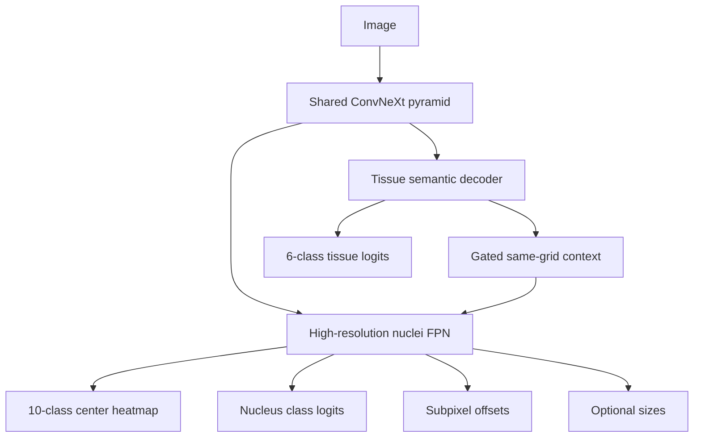

# Prometheus architecture

Prometheus 0.4 treats tissue and nuclei as different tasks sharing shallow visual representations:

## Core contracts

- `PumaMultitaskDataset` preserves nuclei instances and letterboxes images without aspect-ratio distortion.
- `MultitaskBatch` contains images, tissue masks, variable-length nuclei targets and spatial metadata.
- `PrometheusNet` returns a named `MultitaskOutput`, never a positional tuple.
- Tissue output is semantic segmentation at source model resolution.
- Nuclei output is decoded directly into centroid detections from stride-4/8 features.
- `PrometheusMultitaskLoss` logs every explicitly weighted component.
- `evaluate_multitask` compares decoded detections with original instances using centroid F1.
- `PrometheusPredictor` restores masks, centroids and boxes to source-image coordinates.

## Package ownership

| Package | Responsibility |
|---|---|
| `domain` | Stable labels, samples, targets and predictions |
| `data` | PUMA parsing, instance-aware datasets, transforms, targets and collators |
| `models` | Shared backbone, task heads, fusion and typed outputs |
| `losses` | Tissue, nuclei and multitask loss composition |
| `metrics` | Tissue segmentation and exact centroid matching |
| `engine` | Training, evaluation and checkpoint schema v2 |
| `inference` | Center decoding, spatial restoration and typed prediction |
| `submission` / `io` | PUMA serialization and structural validation |
| `legacy` | Frozen semantic U-Net compatibility implementations |
| `api` | Stable composition root used by CLI and Colab |

## Architectural decisions

1. Shallow features are genuinely shared; there are not two independent encoders.
2. Tissue context comes from decoder features and is fused on the same grid through a learnable gate.
3. Joint training does not detach tissue features. A frozen teacher must be a separate explicit experiment.
4. Nuclei geometry is predicted at high resolution, not reconstructed from a stride-32 semantic bottleneck.
5. Touching same-class nuclei remain separate training instances.
6. Transformer and MoE blocks are excluded from the production baseline.
7. Tissue decoder depths are independent of encoder depths.
8. Checkpoint selection uses exact nuclei centroid F1 as the primary metric and tissue Dice separately.

## Spatial convention

All points use pixel-space `(x, y)`. Images are resized with preserved aspect ratio and padded. `ImageMeta` records scale and padding. Inference always inverses that transform before metrics or submission writing.

## Legacy

`DualUNet`, semantic nuclei rasterization and connected-component postprocessing remain importable for old experiments, but they live behind compatibility facades and are not used by CLI, Colab or the 0.4 engine.

See [REFACTORING_GUIDE.md](../REFACTORING_GUIDE.md) for migration rationale, ablations and completion criteria.
