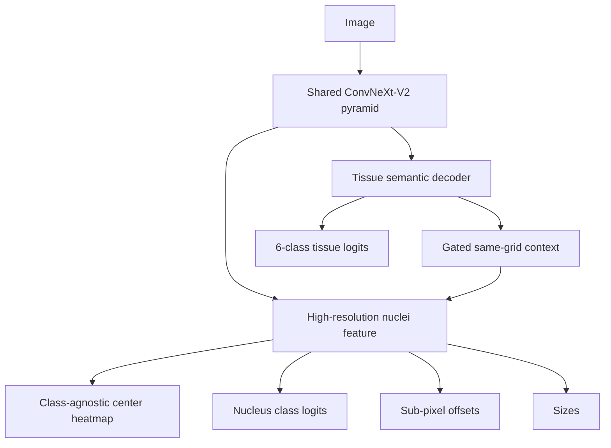

# Prometheus architecture

Tissue and nuclei are treated as different tasks sharing a shallow visual representation.

```mermaid
graph TD
    Input[Image] --> Shared[Shared ConvNeXt-V2 pyramid]
    Shared --> Tissue[Tissue semantic decoder]
    Shared --> FPN[High-resolution nuclei feature]
    Tissue --> Context[Gated same-grid context]
    Context --> FPN
    Tissue --> TissueLogits[6-class tissue logits]
    FPN --> Center[Class-agnostic center heatmap]
    FPN --> Class[Nucleus class logits]
    FPN --> Offset[Sub-pixel offsets]
    FPN --> Size[Sizes]
```

## Package ownership

| Package | Responsibility | May import |
|---|---|---|
| `domain` | Taxonomy, geometry, typed samples | nothing in `prometheus` |
| `layers` | ConvNeXt-V2 primitives (`LayerNorm`, `GRN`, `ConvNeXtBlock`) | nothing in `prometheus` |
| `config` | Config dataclasses + strict TOML loader | nothing in `prometheus` |
| `data` | PUMA parsing, rasterization, transforms, datasets, collators | `domain`, `config` |
| `models` | Backbone, heads, fusion, typed outputs | `domain`, `config`, `layers` |
| `losses` | Tissue, nuclei and multitask composition | `domain`, `models`, `data.targets` |
| `metrics` | Official tissue micro Dice, exact centroid matching | `domain` |
| `engine` | Training, validation, EMA, schedule, checkpoints | all of the above |
| `inference` | Center decoding, dihedral TTA, spatial restoration | `domain`, `models`, `data.spatial` |
| `io`, `submission` | PUMA serialization and structural validation | `domain` |
| `api` | Composition root used by the CLI and the notebook | everything |

The rule that matters: **`domain` is a leaf.** The taxonomy is a contract shared by the
data, metrics and io layers, so it lives there and nowhere else. An earlier revision kept a
second copy in `data/puma/classes.py`, which made `io` depend on `data` and left two class
orderings free to drift apart.

## Contracts that must not be broken

1. **Class order is a checkpoint contract.** `TISSUE_TRAIN_ORDER` and
   `NUCLEUS_TRAIN_ORDER` in `domain/labels.py` define the channel layout of every trained
   model. `tests/unit/domain/test_labels.py` pins them literally. Reordering silently
   mislabels every prediction of every existing checkpoint.
2. **Training indices and submission values are different index spaces.** The tissue TIFF
   uses `TISSUE_SUBMISSION_VALUE`; `io/tissue_tiff.py` is the only place that remaps.
3. **Models return named dataclasses**, never positional tuples. `MultitaskOutput` has five
   dense maps of similar shape; a swapped pair fails silently.
4. **Nuclei are instances, never a semantic mask.** Two touching nuclei of the same class
   stay two training targets.
5. **Nucleus localization is class-agnostic.** The taxonomy is a separate classifier head.
   This is the transfer boundary CellViT++ exploits, and it prevents one center peak per
   class for the same nucleus. `decode_nuclei` rejects a multi-channel center map outright.
6. **All coordinates are pixel-space `(x, y)`.** Images are letterboxed (aspect ratio
   preserved, then padded); `ImageMeta` records scale and padding, and inference inverts it
   before metrics or submission writing.
7. **Centroids use the arithmetic vertex mean**, not the area-weighted polygon centroid,
   because that is what the official evaluator averages.
8. **Tissue rasterization preserves interior rings and resolves overlaps by explicit
   priority**, not by GeoJSON file order. See below.
9. **Checkpoints carry `architecture_version`** and their full model config, both checked on
   load. Version 1 checkpoints are incompatible with the class-agnostic detector.

## Tissue rasterization

PUMA tissue annotations are QuPath GeoJSON: regions overlap, and a region containing another
(necrosis inside tumour, a vessel inside stroma) is stored as an exterior ring plus interior
rings. Two defects follow from ignoring that, and both cost points on exactly the rare
classes:

- dropping interior rings paints the enclosing class over the nested one;
- painting in file order lets a large region listed later erase a small one listed earlier.

`data/puma/rasterize.py` composites one binary layer per class with holes punched out, then
resolves overlaps with `TISSUE_PAINT_PRIORITY` — ordered from largest and least specific to
smallest and most specific, so a nested structure is never erased by its container.
`background` is first because the challenge does not score `tissue_white_background`: on an
overlap, keeping the scored class cannot lose points.

The priority is a documented default, not a fact. Validate it against real data with
`prometheus audit`, which reports how much area each class gains over the naive baseline.

## Metrics

The challenge tissue metric is a **micro** Dice: pool all predictions, compute per-class
Dice on the pooled counts, average the five scored classes, exclude
`tissue_white_background`. Two failure modes inflate it, and both were present here:

- scoring a class absent from both prediction and ground truth as `1.0`;
- dropping such a class from the average via `nanmean`.

The second is worse than a wrong number: it hides a class the model never learned.
`necrosis` sat at exactly `0.0` for a full 5-fold run with no log line reporting it.
`SegmentationEvaluator` now pools counts, scores absent classes `0.0`, keeps every class in
the average, and emits `tissue/micro_dice/<name>` per epoch.

## Pretraining and optimization

The encoder starts from ConvNeXt-V2 Tiny FCMAE weights fine-tuned on ImageNet-22K then
ImageNet-1K, mapped tensor-by-tensor from `timm` with an explicit shape check and a loud
`loaded X/Y` report. The decoders and heads start from scratch, so `build_optimizer` puts
them in separate parameter groups and scales the encoder learning rate by
`backbone_lr_multiplier`. Training both at one rate either destroys the pretrained features
or starves the heads.

## Known limitations

Measured, with fixes ranked in
[`phan-tich-tissue-va-ke-hoach.md`](phan-tich-tissue-va-ke-hoach.md):

- **Step count.** One optimizer step per batch of whole images gives ~11 steps/epoch on 205
  images. A converged segmentation recipe needs two orders of magnitude more. Validation
  Dice was still rising monotonically at the final epoch of all five folds (section 3.1).
- **No rare-class oversampling.** `necrosis` and `blood_vessel` get a few dozen gradient
  exposures in a whole run (section 3.2).
- **Augmentation.** Only the eight dihedral views; no random scale or free rotation, and
  stain jitter is RGB gain/bias rather than a stain-matrix perturbation (section 3.8).
- **Multitask coupling does not pay.** The submission runtime already loads two separate
  checkpoints, and the ranking is a mean of two independent task ranks, so sharing weights
  at training time buys nothing at inference time while the loss terms compete (section
  3.10).
- **Context images are unused.** PUMA ships a 5120x5120 context image per region;
  `necrosis` and `epidermis` are large-scale, context-dependent classes (section 3.7).
